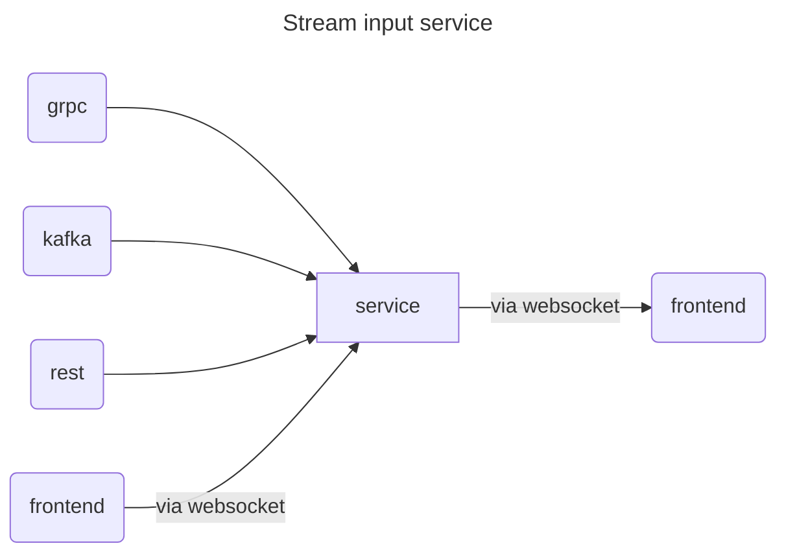

### Display Notification Project
Project building a hello world'ish tutorials together. The project collects inputs from different input sources 
(REST api, STOMP client message, kafka topic and gRPC (to come)) puts them on websocket STOMP topic.

There is a very basic frontend that uses a websocket to show messages in real time. The frontend webui can be found on 
localhost:7000.

The application depends on kafka a kafkatopic being available locally with bootstrapserver reachable at https://localhost:9093

To get updates to show, there are 4 input types as seen in the below diagram.
- Websocket input in the ui
- Rest endpoint at localhost:7000/update
- Kafka topic
- GRPC - not implemented yet

#### Spring events
https://www.baeldung.com/spring-events

#### Websocket
https://spring.io/guides/gs/messaging-stomp-websocket

##### STOMP messages
https://stomp.github.io/

https://docs.spring.io/spring-framework/reference/web/websocket.html
and
https://docs.spring.io/spring-framework/reference/web/websocket/stomp.html

