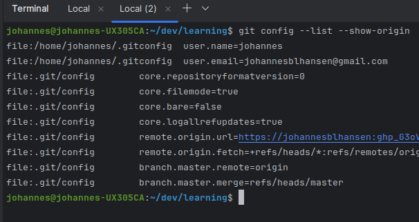

# Git settings

### Git Config Hierarchy


**NOTE** remember to use git command and manual git config --help

Using the git config command it is possible to see where each config property is coming from



```
git config --list --show-origin
```

In the section above I have added the username:privateToken directly in the origin url. Then I dont get prompted for it.

